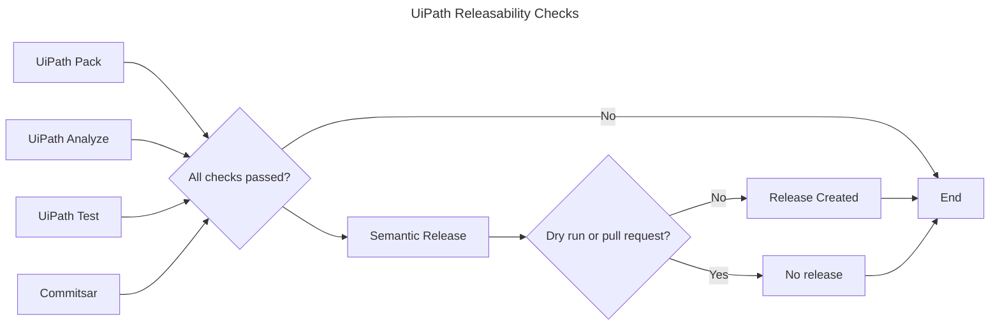

Combines testing, workflow analysis, packing and commit checks to verify that the version available on the triggered branch is ready for release.

Optionally, this workflow can be configured to actually create releases at the end if run on events that are not pull requests.

