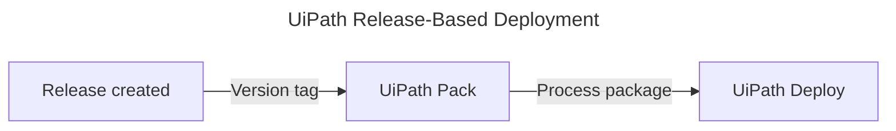

A workflow performing deployments to Orchestrator on release events in GitHub.

```mermaid
---
title: UiPath Release-Based Deployment
---
flowchart LR
    release-created[Release created]
    uipath-pack[UiPath Pack]
    uipath-deploy[UiPath Deploy]

    release-created--"Version tag"-->uipath-pack
    uipath-pack--"Process package"-->uipath-deploy
```